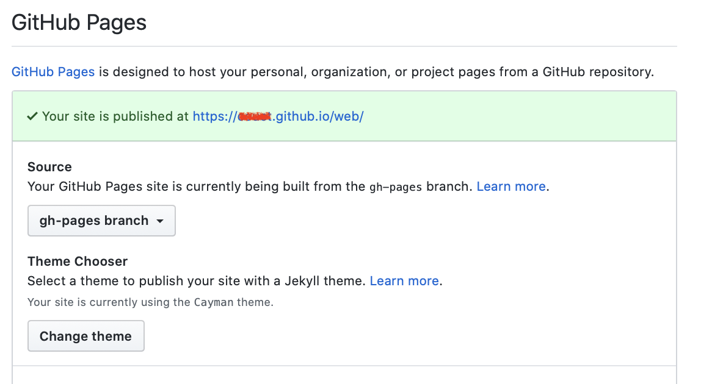

The ROOT team has adopted [Jekyll](https://jekyllrb.com/){:target="_blank"} for generating
the ROOT web site. The ROOT web site uses the ["Minimal-Mistakes" theme](https://mmistakes.github.io/minimal-mistakes/){:target="_blank"}.
Many scripts and functionalities have been added compare to this original theme.

This page gives you the instructions to:

1. Get the sources of the ROOT web site and edit them
2. Generate a local running version of this web site.

## Get the ROOT web site sources

You need to follow the following steps:

1. Make sure have set up git on our system
2. You should have registered a GitHub account and [forked the ROOT web site repository](https://github.com/root-project/web/fork){:target="_blank"}.
3. Then go in the "Settings" of the forked copy:

   

4. In the "GitHub Pages" section you should see
   **gh-pages branch** . After a while a green line should show up saying your site is published.
   like on the following picture:

   


5. Clone your forked ROOT repository using:
```
git clone https://github.com/<your GitHub username>/web
```

You now have the ROOT web site sources (from github) on your local machine. You can
"commit" and "push" changes to the origin or do "Pull Requests" upstream.

When you push changes to the origin (your forked copy) you can see them alive on:

`https://<your GitHub username>.github.io//web`.

> **But**  that can be very slow because you need to wait github rebuild your site before
> seeing the change you did. That's why it might be much more efficient to run a server
> locally as explained in the next section.

## Generate a local running version of the ROOT web site

This section gives you the instructions to generate a local running version
of the ROOT web site. The informations presented here are largely inspired from the
[quick start page of the Jekyll web site](https://jekyllrb.com/docs/){:target="_blank"}.

### Prerequisites

The prerequisites/requirements are the same presented on the
[jekyll site](https://jekyllrb.com/docs/installation/#requirements){:target="_blank"}.

### Install instructions

The install instructions differ a bit from the ones you can find on the
[Jekyll web site](https://jekyllrb.com/docs/){:target="_blank"}
as you do not need to create a new web site but instead
get it from github. So the steps are:

1. Install a full [Ruby development environment](https://jekyllrb.com/docs/installation/){:target="_blank"}.

2. Install Jekyll and [bundler](https://jekyllrb.com/docs/ruby-101/#bundler){:target="_blank"} [gems](https://jekyllrb.com/docs/ruby-101/#gems){:target="_blank"}.
```
gem install jekyll bundler
```

3. Get the ROOT web site source from github.
```
git clone https://github.com/root-project/web.git web
```
You can also clone a forked copy from you own github as explained in the
[previous section](#get-the-root-web-site-sources)

4. Change into your new directory.
```
cd web
```
You will notice that the current git branch is `gh-pages`
```
% git checkout
Your branch is up to date with 'origin/gh-pages'.
```
Stay on this branch. It is the one used to [automatically build the web
site on the git repository](#publish-your-modifications).

5. Build the site and make it available on a local server.
```
bundle exec jekyll serve
```

6. After about 30 seconds you should get an output similar to
```
Configuration file: /path/to/the/directory/web/_config.yml
            Source: /path/to/the/directory/web
       Destination: /path/to/the/directory/web/_site
 Incremental build: disabled. Enable with --incremental
      Generating...
       Jekyll Feed: Generating feed for posts
                    done in 21.638 seconds.
 Auto-regeneration: enabled for /path/to/the/directory/web
    Server address: http://127.0.0.1:4000/web/
  Server running... press ctrl-c to stop.
```

7. Your server is now running. As suggested in the previous output open the url
`http://127.0.0.1:4000/web/`
in your favorite web browser.

### Modify the web site

Now you can start to modify and create files in the `/path/to/the/directory/web/`
file structure. Each time you create a new file or save a modified version of a file
the server will notice it and will regenerate the web site. You will get an output
similar to:
```
Regenerating: 1 file(s) changed at 2020-02-19 10:40:02
              resources/web/index.md
 Jekyll Feed: Generating feed for posts
              ...done in 9.877795 seconds.
```
once "`... done`" is displayed you can reload the web site from your browser to see your
changes.

It is not necessary to restart the server each time you do a modification except if you
modify the file `web/_config.yml`

You may notice that the command `bundle exec jekyll serve` generated a folder `_site` in
the `/path/to/the/directory/web/` folder. This is the html version of the web site. Do not
modify or create files in that folder. This folder is ignored by git.

### Publish your modifications

Once you are happy with your modifications, you can publish them via a direct push (if you have
the rights) to the github repository or via a Pull Request if you work on a forked copy as described
in [the previous section](#get-the-root-web-site-sources). After a while the web site
`https://root-project.github.io/web/` will be automatically updated by git.
